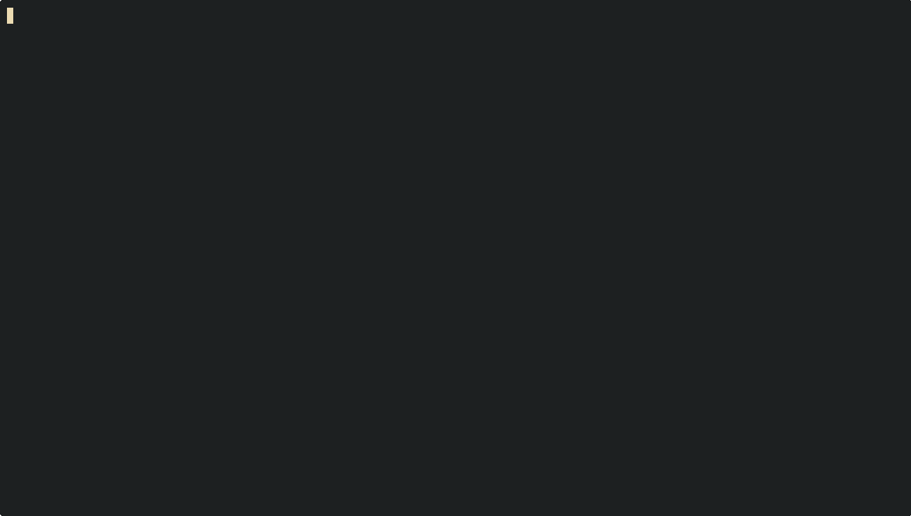

#+title: Waldl
#+description: Script to download images from wallhaven.cc 
#+author: Touhidul Shawan

* introduction
Script to download wallpapers from [[https://wallhaven.cc/][wallhaven]]
* installation
#+begin_quote
- clone the repository
#+begin_SRC sh :results output
git clone https://github.com/touhidulshawan/waldl
#+end_SRC
- go to directory
#+begin_SRC sh :results output
cd waldl
#+end_SRC
~important: First install necessary python dependencies.~

- run the program
#+begin_SRC sh :results output
python waldl.py
#+end_SRC
#+end_quote
* NSFW [Not Safe For Work]
  + [X] [[https:github.com/touhidulshawan/waldl/issues/2][Will NSFW be supported?]]
*** To download NSFW wallpapers you have to add you =api= key.
- Create or sign-in an Account on [[https://wallhaven.cc][wallhaven.cc]]
- Go to =Setting > Account= from User Menu
- Generate an =API= key
